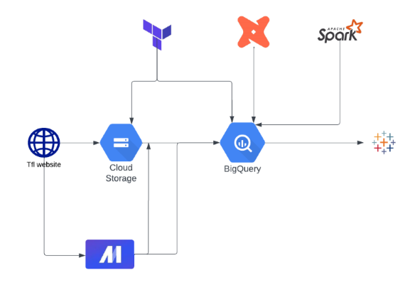
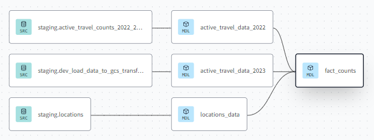
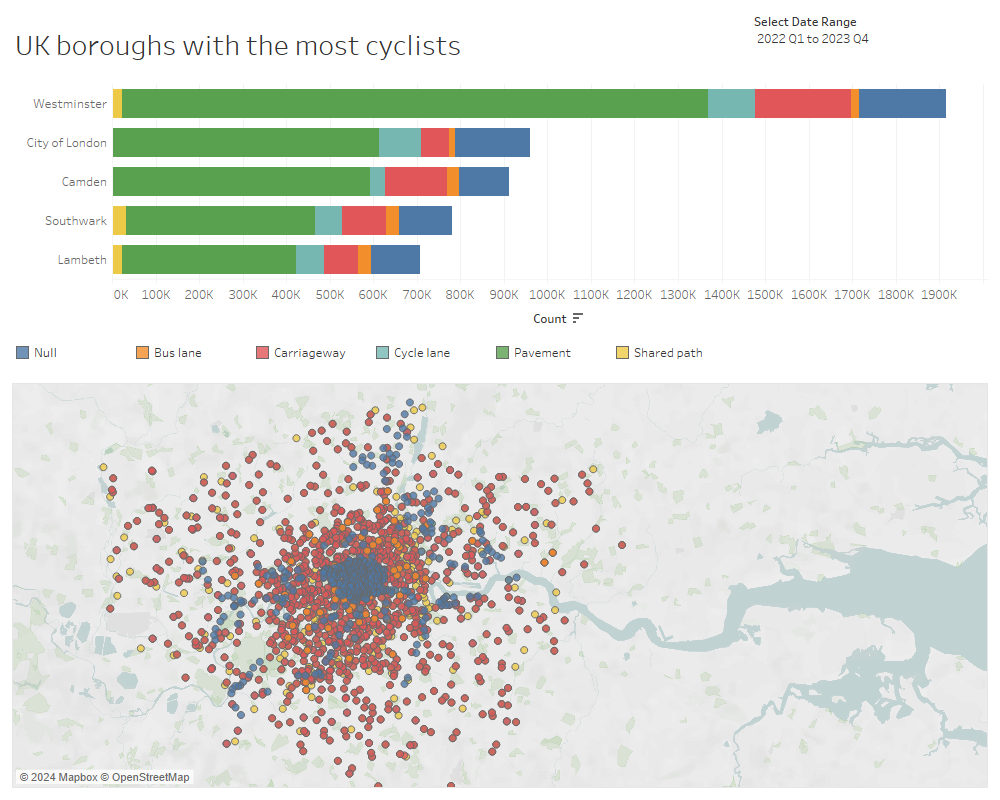

# TFL cycling data project documentation

## Overview

This project is a part of the [Data Engineering Zoomcamp course](https://github.com/DataTalksClub/data-engineering-zoomcamp) held by [DataTalks.Club](https://silabs.alationcloud.com/).
This project covers some areas of Data Engineering and Business Intelligence Tools.
The project includes the following:
* building the cloud infrastructure
* creation of a pipeline for transfer data
* uploading data into the database
* setting up a monthly update
* transformation of the data to prepare it for the BI dashboard
* creation of a BI dashboard

## Problem description
	
This project will create an ETL pipeline to extract cycling infrastructure data from Transport for London's (TfL) open data portal. By loading this data into a cloud database, we can facilitate the creation of user-friendly applications and insightful analyses. This analysis could include identifying areas lacking proper cycling infrastructure, assessing the effectiveness of existing facilities, and informing future cycling network development efforts.

The data set for this project is from [https://cycling.data.tfl.gov.uk/](https://cycling.data.tfl.gov.uk/)
The data dictionary is available in the [release note](https://cycling.data.tfl.gov.uk/ActiveTravelCountsProgramme/0%20Strategic%20active%20travel%20counts%20-%20release%20note.pdf)

## Technologies
* Cloud: GCP
* Infrastructure as code (IaC): Terraform
* Workflow orchestration: Mage
* Data warehouse: BigQuery
* Transformation: dbt, spark
* Dashboard: Tableau

## Reproducing this repo

* Prepare GCP service accounts with appropriate permissions for GCS and BQ
* Set up a VM on Google Cloud with docker, docker-compose, and git.
  * Clone this repo to the VM
  * Set up appropriate GCP credentials on the VM (including installing google cloud SDK and granting appropriate permissions)
* Change user-specific attributes in code:
  * In Terraform variables.tf change project id, region, and name of the GCS bucket to your GCS bucket
* In docker-compose.yaml change the environment variables for google cloud authentication, your GCP project ID, and the GCP bucket you're using
* Build image using docker-compose build in /mage/, and run mage using docker-compose up
  * Forward port 6789 and connect to it on your local machine
* Grant dbt cloud the appropriate permissions for GCP, connect it to your DWH and run prod job

## Dashboard

